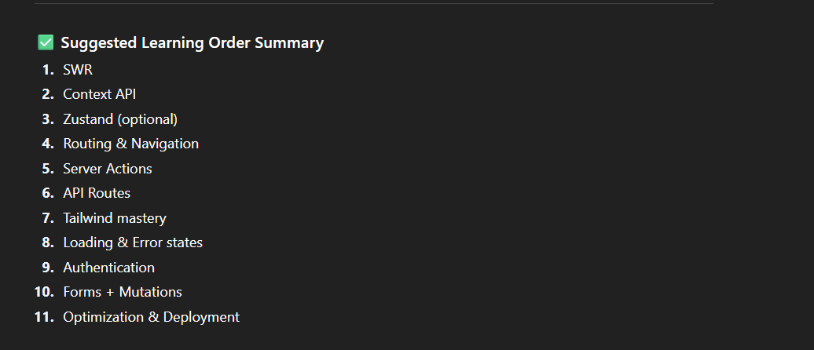

# Next To learn things :

## NOTE : RATE LIMITING ACTUALLY SHOULD BE DONE USING REDIS IN PRODUCTION TO MANAGE DISTRIBUTED RATE LIMITING ACROSS MULTIPLE INSTANCES

## CORS is actually for browser, browsers expects "allow cross origin : frontend url" as a response header to continue

## And also expects the "allow cross origin credentials" to be true, if we are sending cookies via frontend

## This is irrelevant when using libraries and stuff like requests, but only relevant when using browsers

## The server returns the allow cross origin and such headers only if the request contains a 'Origin' header with frontend URL

## server sent events (SSE) can be done, it is basically one long connection with the server and the server sends relevant updates timely